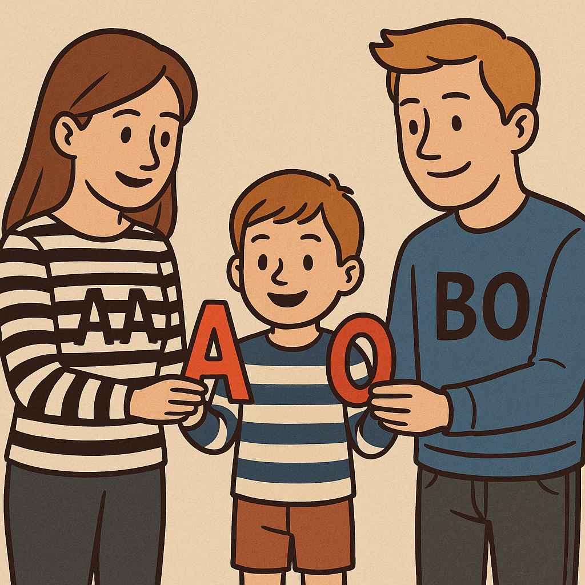

inheritance
===========

   It's not just fashion sense that is inherited!

We inherit all sorts of things from our parents, even beyond a bad sense of humour! One particular trait that is inherited from parents is blood type. Blood type is determined by the alleles we inherit from our parents. There are three main alleles for blood type: A, B, and O. The A and B alleles are dominant, while the O allele is recessive.

These alleles determine your genotype, which in turn determines your blood type (phenotype). Here are the possible genotypes and their corresponding blood types:

- AA or AO: Blood type A
- BB or BO: Blood type B
- AB: Blood type AB
- OO: Blood type O

Let's look at an example. If one parent has blood type A (genotype AO) and the other parent has blood type B (genotype BO), their children could have the following genotypes [AO, BO, AB, OO].

This means that the children could have any of the four blood types: A, B, AB, or O. The specific blood type of each child would depend on which alleles they inherit from their parents.

We're not going to worry about Rh factor in this problem, just the ABO blood group system.

Problem overview
----------------

We're going to determine how the statistics of a population's genotypes and phenotypes change over generations. This can inform us also about who can donate blood to whom in a population. But we'll split this problem into a couple of parts and build up to it.

Part 1: Genotype to Phenotype
-----------------------------

Let's warm up by implementing the ``genotype_to_phenotype`` function. This function will take a genotype (a string representing the alleles) and return the corresponding blood type (phenotype).

The function should check that the input genotype is valid (i.e., it should be one of "AA", "AO", "BB", "BO", "AB", or "OO"). If the genotype is valid, the function should return the corresponding blood type. If the genotype is invalid, the function should return "Invalid genotype".

Here's some example usage of the function:

.. code-block:: python

    print(genotype_to_phenotype("AA"))  # Output: A
    print(genotype_to_phenotype("BO"))  # Output: B
    print(genotype_to_phenotype("AB"))  # Output: AB
    print(genotype_to_phenotype("OO"))  # Output: O
    print(genotype_to_phenotype("AC"))  # Output: Invalid genotype

Part 2: Simulating inheritance
------------------------------

Next, we'll implement the ``produce_offspring`` function. This function will take the genotypes of two parents and simulate the inheritance of alleles to produce the genotype of an offspring.

.. margin::

    The ``random.choice()`` function can be used to randomly select an item from a sequence. This can be a list but it can also be a string, since strings are sequences of characters. So ``random.choice("AO")`` could return either "A" or "O".

The function should randomly select one allele from each parent to form the offspring's genotype. You can use the ``random.choice()`` function from the ``random`` module to help with this. We've already imported the ``random`` module for you.

.. margin::

    Single characters can be compared alphabetically in Python, so "A" < "O" will evaluate to ``True``, but "O" < "A" will evaluate to ``False``.

Note that the order of alleles in the genotype does not matter (e.g., "AO" is the same as "OA") - so you should sort the alleles in the resulting genotype alphabetically before returning it.

Here's some example usage of the function:

.. code-block:: python

    print(produce_offspring("AO", "BO"))  # Output could be AO, AB, BO, or OO
    print(produce_offspring("AA", "OO"))  # Output will always be AO
    print(produce_offspring("AB", "AB"))  # Output could be AA, AB, or BB

Part 3: Generation simulation
-----------------------------

Now let's simulate how the next generation of a population is formed based on the genotypes of the current generation. We'll implement the ``next_generation`` function. This function will take a list of genotypes representing the current population and produce a new list of genotypes representing the next generation.

.. margin::

    There's a couple of different ways you could implement the pairing of parents. I would recommend considering how the ``random.shuffle()`` could be very useful for making this quite simple for you!

The first thing this function needs to do is randomly pair up individuals in the current population to form parents. If the population has an odd number of individuals, one individual will not be able to mate and will be left out of the next generation (tag yourself). Don't worry about who is paired with whom - just pair them randomly and forget the ethical implications!

Once you have your pairs of parents, loop through each pair and use the ``produce_offspring`` function to generate an offspring genotype for each pair. Add each offspring genotype to the population list to create the next generation. Return this new list of genotypes as your result.

Here's some example usage of the function:

.. code-block:: python

    import random

    random.seed(117)     # this ensure your random numbers match mine

    print(next_generation(["AO", "BO", "AB", "OO"]))