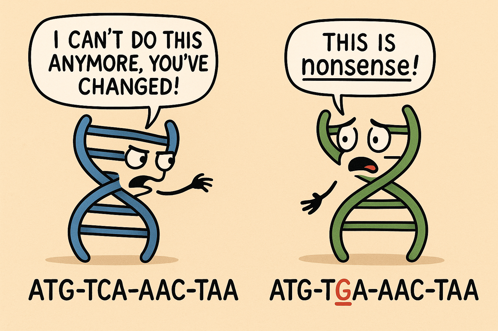

mutations
=========

*Difficulty*: ★★☆☆☆

    It's not you, it's not me, it's just mutations.

In `the previous problem <genome.html>`_, we learned about genomes, nucleotide sequences, and how ribosomes
build proteins from those sequences. In this problem, we'll consider how mutations can cause things to go
wrong when trying to build those proteins.

Concepts
--------

First, let's review some key concepts (that I may or may not have only just learned myself!). We're can think
about two different types of mutations that can occur in a nucleotide sequence:

- **Point mutations**: A single nucleotide is changed to a different nucleotide. For example, an "A" might be changed to a "G".
- **Frame-shift mutations**: One or more nucleotides are added to or removed from the sequence. For example, an "A" might be inserted into the sequence, or a "T" might be deleted.

.. figure:: ../../_static/point_vs_frame_shift.png
    :alt: Point mutation vs frame-shift mutation
    :align: center
    :width: 600px

    Some mutations have bigger effects than others.

You can imagine that a point mutation will have a smaller effect on the resulting protein than a frame-shift
mutation, since the latter will change the reading frame of all subsequent codons.

We can further classify mutations based on their effect on the resulting protein:

- **Silent mutations**: The mutation does not change the amino acid that is produced. For example, both "GAA"and "GAG" code for the amino acid glutamic acid, so a mutation from "GAA" to "GAG" would be silent.
- **Missense mutations**: The mutation changes the amino acid that is produced. For example, a mutation from "GAA" to "GAC" would change the amino acid from glutamic acid to aspartic acid.
- **Nonsense mutations**: The mutation changes a codon to a stop codon, causing the protein to be truncated. For example, a mutation from "GAA" to "TAA" would change the codon to a stop codon.

.. admonition:: Required humour

    You should now check your learning by looking at the first image again now you know what a nonsense mutation is! If you don't laugh, you must not have understood the concept properly, there's no other explanation.

For the purposes of this problem, we'll only be thinking about point mutations, but if you're keen there's an extra credit section at the end where you can try to handle frame-shift mutations as well.

Your task
---------

Imagine you have a reference nucleotide sequence (the "correct" sequence) from some perfect organism that has no mutations. Next you have a second nucleotide sequence from an organism that may have some mutations relative to the reference sequence.

Part 1: Find the mutations
--------------------------

First, implement ``find_point_mutations(reference, mutated)`` which takes in two nucleotide sequences (strings) and returns a list of locations (0-indexed) where the point mutations occur. You can assume that both sequences are the same length and only differ by point mutations (i.e., no insertions or deletions). You can also assume that the sequences only contain the characters "A", "C", "G", and "T".

Here are some test cases to get you started:

.. code-block:: python

    find_point_mutations("ACGT", "ACGT")  # should return []
    find_point_mutations("ACGT", "AGGT")  # should return [1]
    find_point_mutations("ACGT", "TGCA")  # should return [0, 1, 2, 3]

Part 2: Classify the mutations
------------------------------

Now the real question is: what effect do those mutations have on the resulting protein? To answer this, implement ``classify_point_mutations(reference, mutated)`` which takes in two nucleotide sequences (strings) and returns a list of tuples, where each tuple contains the index of the mutation and its classification ("silent", "missense", or "nonsense").

You can use the genetic code table from the previous problem to determine the amino acids produced by each codon.

**To simplify things**, the sequences that you receive will always start with a start codon ("ATG") and end with a stop codon ("TAA", "TAG", or "TGA"), and the length of the sequences will always be a multiple of 3. There will also only be point mutations (no insertions or deletions), and only one mutation will occur per codon.

Recall that silent mutations do not change the amino acid, missense mutations change the amino acid, and nonsense mutations change a codon to a stop codon.

Here are some test cases to get you started:

.. code-block:: python

    reference = "ATGGAGCCATAA"

    classify_mutations(reference, "ATGGAGCCATAA")   # should return []
    classify_mutations(reference, "AGGGAGCCGTAA")   # should return [(1, "missense")]
    classify_mutations(reference, "ATGGAGCCCTAA")   # should return [(8, "silent")]
    classify_mutations(reference, "ATGTAGCCCTAA")   # should return [(3, "nonsense"), (8, "silent")]

.. admonition:: Bonus

    What do you notice about the relative frequencies of silent, missense, and nonsense mutations? Does that match up with your intuition? You can try printing out the counts from each test case to see if you notice any patterns.

Part 3: (Extra credit) Handle frame-shift mutations
---------------------------------------------------

*Difficulty*: ★★★★★ (I mean honestly it's like 7 stars haha)

.. admonition:: Extra credit

    This part is optional and quite a lot more difficult than the rest of the problem! I'd probably skip this and come back to it once you're done with the other problems.

A much more difficult problem is to handle frame-shift mutations, where nucleotides are inserted or deleted from the sequence. This changes the reading frame of all subsequent codons, which can have a drastic effect on the resulting protein.

To identify all insertions, deletions, and substitutions between two sequences via brute force you would need to try all possible ways of aligning the two sequences, which is computationally expensive. Imagine, you would need to try adding or removing any number of characters at each location, as well as changing every character at every location...and *all combinations* of those. We can calculate exactly that cost for two sequences of length :math:`n` and :math:`m`, since the number of possible alignments is given by

.. math::

    \text{Number of alignments} = \sum_{k=0}^{\min(n, m)} \binom{m}{k} \binom{n}{k} 2^k

Which means you algorithm time complexity is exponential, approximately

.. math::
    
    T_{\rm brute} = O\left( 2^{n \cdot m} \right)

That's clearly computationally infeasible for even moderately sized sequences! But fear not, there is a well-known dynamic programming algorithm called the `Needleman-Wunsch algorithm <https://en.wikipedia.org/wiki/Needleman%E2%80%93Wunsch_algorithm>`_ that can find the optimal alignment in polynomial time, specifically

.. math::

    T_{\rm NW} = O(n \cdot m)

We're going to work together here to implement this algorithm to align two sequences, and then use that alignment to identify mutations.

Part 3a: Implement Needleman-Wunsch
^^^^^^^^^^^^^^^^^^^^^^^^^^^^^^^^^^^

First, we're going to implement the Needleman-Wunsch algorithm itself. You're going to write the code for ``needleman_wunsch(s1, s2, match, mismatch, gap)`` that takes in two sequences (strings) and returns a tuple of two aligned sequences (strings), where gaps are represented by the "-" character. The parameters ``match``, ``mismatch``, and ``gap`` are the scores for matching characters, mismatched characters, and gaps, respectively.

Your function should do the following steps:

1. Create a scoring matrix (a 2D array) that has size n x m, where n and m are the lengths of the two sequences.
2. Create a traceback matrix (a 2D array) of the same size to keep track of the moves made during the alignment (start with empty strings).
3. Initialize the first row of the matrix, each cell is equal to the one to its left plus the gap penalty.
4. Initialize the first column of the matrix, each cell is equal to the one above it plus the gap penalty.
5. Fill in the rest of the matrix using the following rules:
    - Calculate three scores, one for a diagonal move (match or mismatch), one for an up move (gap in sequence 2), and one for a left move (gap in sequence 1).
        - The diagonal score is the score from the cell diagonally above and to the left plus either the match score (if the characters are the same) or the mismatch score (if they are different).
        - The up score is the score from the cell above plus the gap penalty.
        - The left score is the score from the cell to the left plus the gap penalty.
    - The score for the current cell is the maximum of the three scores.
    - Based on which score was chosen, record the move (diagonal, up, or left) in a traceback matrix (as a 'D', 'U', or 'L').
6. Once the matrix is filled in, perform a traceback starting from the bottom-right cell of the traceback matrix to construct the aligned sequences.
    - If the move is diagonal, add the corresponding characters from both sequences to the aligned sequences.
    - If the move is up, add the character from sequence 1 and a gap to sequence 2.
    - If the move is left, add a gap to sequence 1 and the character from sequence 2.
7. Reverse the aligned sequences since they were constructed backwards during the traceback.
8. Return the aligned sequences as a tuple.

Tada! You now have an efficient way to align two sequences, even if they have insertions or deletions.

Part 3b: Identify mutations from the alignment
^^^^^^^^^^^^^^^^^^^^^^^^^^^^^^^^^^^^^^^^^^^^^^

Now that you have the aligned sequences, you can use them to identify mutations!

Implement ``detect_mutations(reference, mutated)`` which takes in two nucleotide sequences (strings) and returns a dictionary with three keys: "alignment", "point_mutations", and "frameshift_mutations".

- The value for "alignment" should be a tuple of the two aligned sequences (strings) returned by ``needleman_wunsch``.
- The value for "point_mutations" should be a list of tuples, where each tuple contains the index of the mutation, the original nucleotide, and the mutated nucleotide.
- The value for "frameshift_mutations" should be a list of dictionary, where each dictionary contains the keys: "type" - either "insertion" or "deletion", "seq" - the sequence that was inserted or deleted, "loc" - the location of the insertion/deletion in the mutated genome, and "length" - the length of the insertion or deletion.

The end results should look something like this:

.. code-block:: python

    reference = "ATGGAGCCATAA"
    mutated   = "ATGGTAGCCTAGA"

    result = detect_mutations(reference, mutated)

    # result["alignment"] should be:
    # ("ATGGAGCCATAA",
    #  "ATGGTAGCCTAA")

    # result["point_mutations"] should be:
    # [(4, 'A', 'T'), (8, 'A', 'C')]

    # result["frameshift_mutations"] should be:
    # [{"type": "insertion", "seq": "G", "loc": 11, "length": 1}]
