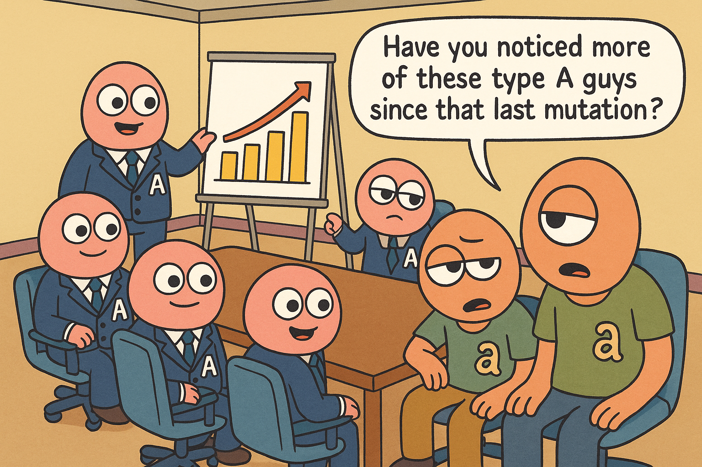
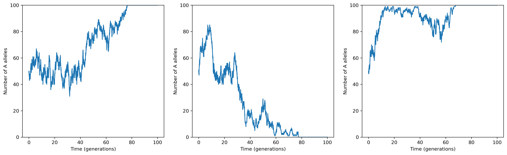
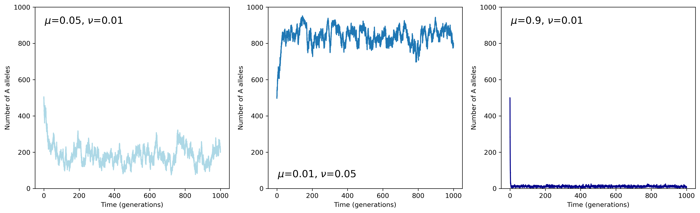
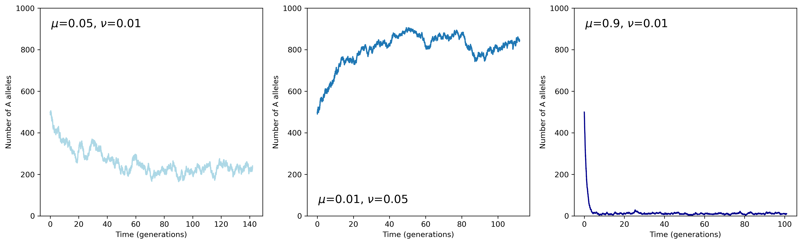
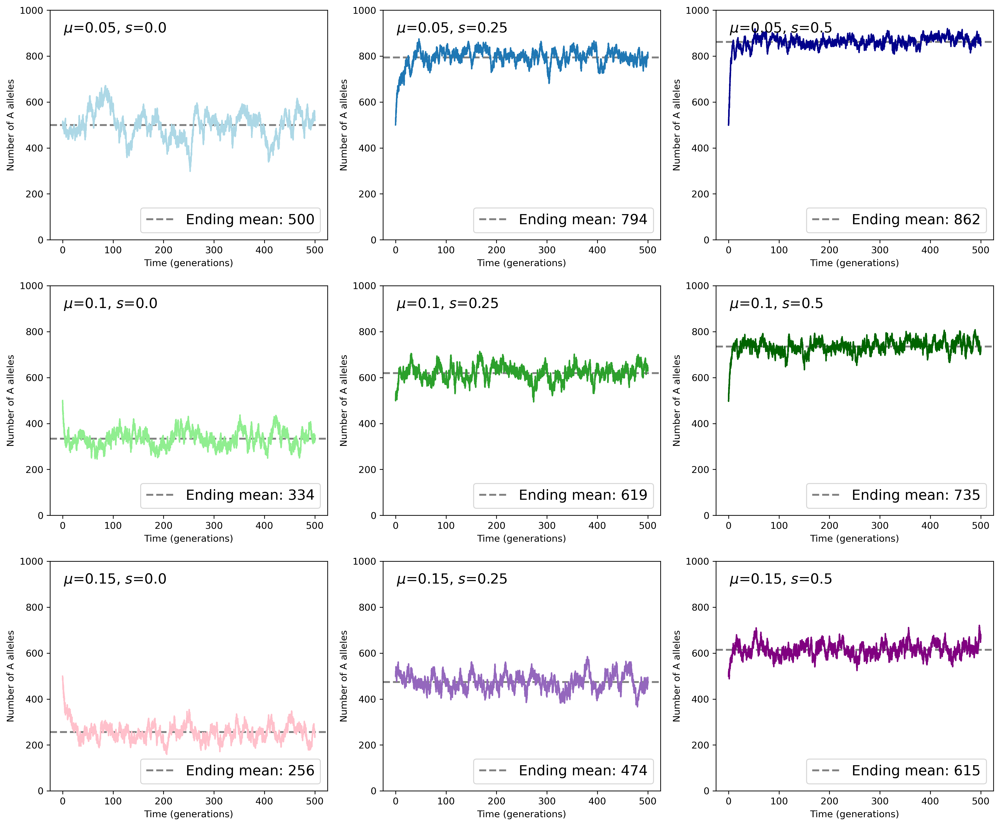
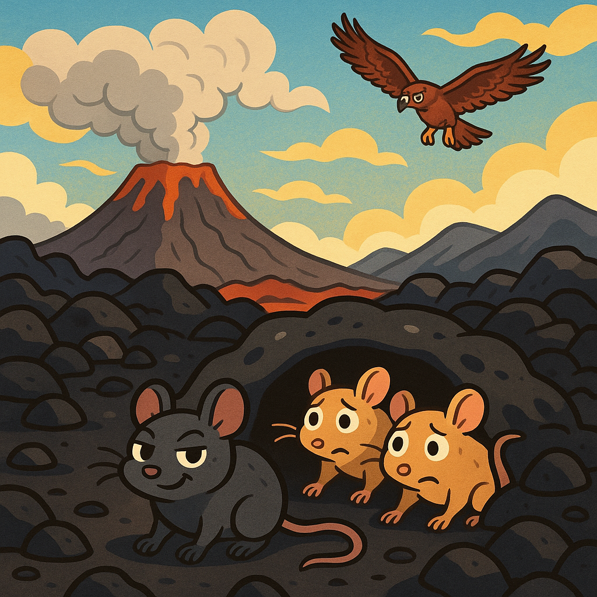
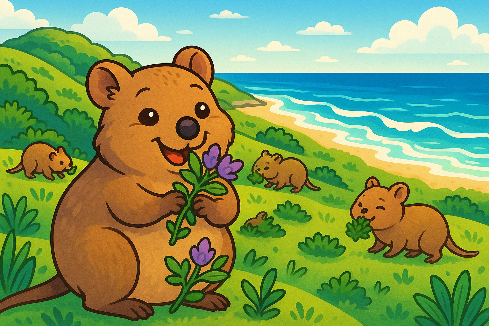
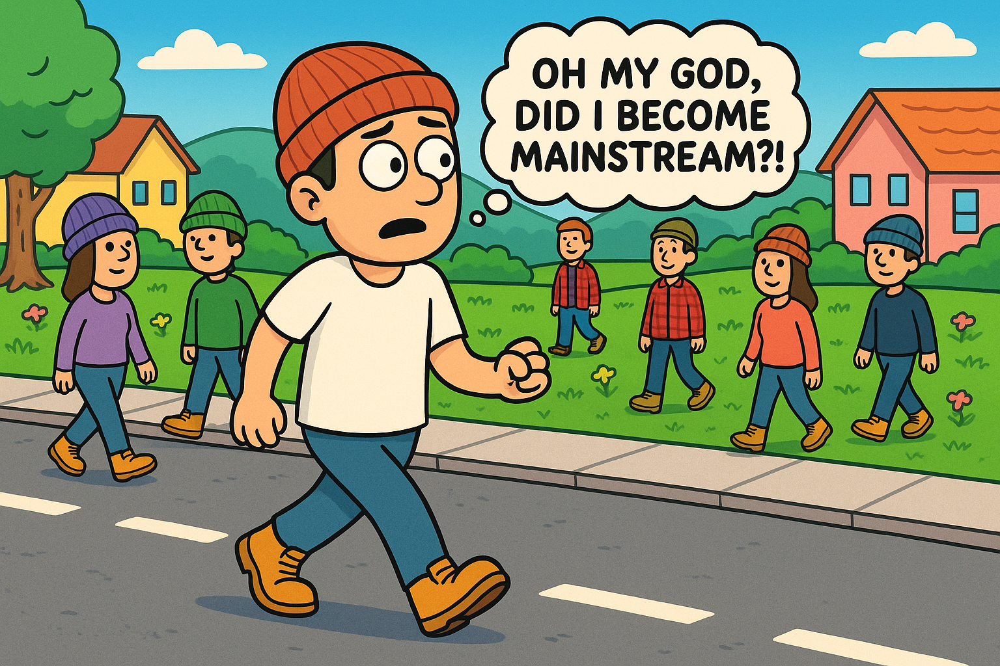

survival
========

*Difficulty*: ★★★★☆

    Survival of the fittest!

Welcome to the survival problem - where only the fittest survive!

Nah just kidding. In this problem you're going to simulate the spread of a mutation in a population of alleles and track genetic drift and natural selection. Not too tricky right?

.. admonition:: Keep going until the end!

    This one has a lot of parts, but trust me, part 4 will make it all worth it 😁

Concepts
--------

For this problem, we're going to be implementing a Moran process. This is a simple model of genetic drift in a fixed-size population. In this population, individuals can have one of two alleles: :math:`A` or :math:`a`.

The population size is constant, and at each time step, one individual is chosen to reproduce and one individual is chosen to die. During reproduction, mutations can occur, changing an allele from :math:`A` to :math:`a` or vice versa. The rate of an :math:`A` allele mutating to :math:`a` is given by :math:`\mu`, and the rate of an :math:`a` allele mutating to :math:`A` is given by :math:`\nu`.

We can also model natural selection by assigning a relative fitness to the alleles. Let's say allele :math:`A` has a relative fitness of :math:`s` compared to allele :math:`a`, such that during each timestep, the probability of choosing an individual with allele :math:`A` to reproduce is proportional to :math:`1 + s`, while the probability of choosing an individual with allele :math:`a` is proportional to :math:`1`. Clearly, if :math:`s > 0`, allele :math:`A` is favored by selection and is likely to increase in frequency over time.

We **could** do some maths here to write out a diffusion equation for the allele frequency dynamics...

.. dropdown:: Warning: Maths is hidden here!

    If you really want to get into the nitty-gritty of the maths behind this process, the allele frequency dynamics can be described by the following diffusion equation which has terms for selection, mutation, and genetic drift:

    .. math::

        \begin{split}
            \bar{\omega} \cdot \frac{\partial P(x, \tau)}{\partial \tau} = &- \underbrace{s \frac{\partial}{\partial x}\bigg(P(x, \tau)\cdot x(1-x)\bigg)}_{\text{selection}} \\
            &+ \underbrace{ \mu \frac{\partial}{\partial x} \bigg( x \cdot P(x, \tau) \bigg) - \nu \frac{\partial}{\partial x} \bigg( (1 - x) \cdot P(x, \tau) \bigg)}_{\text{mutation}} \\ 
            &+ \underbrace{ \frac{1}{N} \frac{\partial^2}{\partial^2 x}\bigg(P(x, \tau)\cdot x(1-x)\bigg) }_{\text{drift}},
        \end{split}

    where :math:`\bar{\omega}` is the average fitness, which is given by

    .. math::

        \bar{\omega} =  \frac{1}{N} \bigg( n(1 + s) + (N - n) \bigg),

    :math:`P(x, \tau)` is the probability that the frequency of allele :math:`A` is :math:`x` at time :math:`\tau`, :math:`s` is the relative fitness of allele :math:`A`, :math:`\mu` is the mutation rate from :math:`A` to :math:`a`, :math:`\nu` is the mutation rate from :math:`a` to :math:`A`, :math:`N` is the population size, and :math:`n` is the number of individuals with allele :math:`A`.

    For more details and an animation of this whole process, check out `this link <https://www.tomwagg.com/html/moran_circles.html>`_.
                                                
...or we can just simulate it!

Self-assessment
---------------

This problem doesn't come with its own tests, but throughout the problem I've included some example plots of what you might expect the evolution of the system to look like. If your plots look similar to these, then you're probably on the right track!

This is of course a stochastic simulation, so your plots won't look exactly the same as mine, but they should have similar trends.

.. admonition:: My motivation

    Note that this isn't just me being lazy and not writing tests! One of the things you need to learn as a programmer is how to validate your code when there aren't any tests provided. This is a really important skill to have, especially in scientific programming where you might be implementing new algorithms that don't have any existing tests.

    So in this problem, I'm encouraging you to think critically about your implementation and how to validate it against expected behaviour and your intuition for how the evolutionary process *should* behave.

Your Task
---------

In this problem, you're going to implement a **class** called ``MoranModel`` in the ``problems/survival.py`` file. We're going to put what you've learned about classes, visualisation, and class inheritance to test. Excited? Me too!

Part 1 - Basic Evolution with Drift
-----------------------------------

1a - The Setup
^^^^^^^^^^^^^^

First up, implement the basic Moran process with genetic drift only. This means no selection (:math:`s = 0`) and no mutations (:math:`\mu = \nu = 0`), meaning it's fine for your class to ignore these parameters for now.

You'll need to implement the methods that are already outlined in the ``MoranModel`` class in ``problems/survival.py``.

**Initialisation**: First, consider how to initialise your class (this is done in the ``__init__`` method). You'll need to store the parameters as class attributes certainly, but also consider how you could store the counts of the A alleles over time, that'll be useful for you to track how things have evolved!

**The core logic**: Next, implement the core logic of the Moran process in the ``next_timestep`` method. This is where you'll randomly select one individual to reproduce and one individual to die, and update the counts of each allele accordingly. Since we're only considering genetic drift for now, the selection of individuals to reproduce and die should be completely random and based only on their current counts (e.g. if there are 7 A alleles and 3 a alleles, the probability of selecting an A allele to reproduce should be 0.7). This method will of course update the number of A/a alleles in the population, but you might also want to consider how to store the counts over time for later analysis.

**Advancing generations**: After that, implement the ``next_generation`` method, which should call ``next_timestep`` a number of times equal to the population size to simulate a full generation. This gives each individual a chance to reproduce and die and is a more logical unit of time to track.

**Running the simulation**: Finally, implement the ``run_for_generations`` method, which should run the simulation for a specified number of generations. This method should call ``next_generation`` in a loop.

.. admonition:: Testing time

    Now before you go any further, consider how you can test you implementation so far. If you started with a reasonably small population size (e.g. 100 individuals), what would you expect the allele counts to look like over time? What would you expect to happen after a long period of time? (I'll give away the answer to this below...)

1b - Plotting your results
^^^^^^^^^^^^^^^^^^^^^^^^^^

Now that you've implemented the basic Moran process with genetic drift, it's time to visualise your results! Implement the ``plot`` method in your ``MoranModel`` class. This method should create a plot showing the counts of allele A as a function of time. I recommend recording the counts at every timestep, but making your x-axis in units of generations for clarity.

You'll want to use ``matplotlib`` for this, and specifically the ``plt.plot()`` function to create the line plot. I recommend using ``plt.xlim()`` or ``ax.set_ylim()`` to set your y-limits to always show the full range (0, to the size of the population). And don't forget to label your axes!!

Here are three examples of what your plots might look like. Remember, this is a stochastic simulation, so I've made these plots with the exact same initial parameters (:math:`N = 100`, :math:`n_A = 50`, :math:`s = 0`, :math:`\mu = \nu = 0`), but the plots are still different, and yours may look different compared to these too.

    What do you notice happening in some of these plots? We'll talk about it more in the next section!

1c - Running until fixation
^^^^^^^^^^^^^^^^^^^^^^^^^^^

You may have noticed that in some of your plots, the allele counts eventually reach either 0 or the full population size. This is called fixation, and it's a natural outcome of genetic drift in a finite population. Since there's no mutation, once one allele reaches fixation, the other allele is lost from the population forever (sad).

Instead of running for a fixed number of generations, implement a new method called ``run_until_fixation`` that runs the simulation until one allele reaches fixation. This method should keep calling ``next_generation`` until the count of allele A is either 0 or equal to the population size.

Try making a plot of the allele counts over time when you run until fixation. How long does it take for fixation to occur? Does it vary between runs?

.. figure:: ../../_static/moran_drift_fixation.png
    :align: center

    Notice the different x-axis scales here - and you never know which allele will win!

.. dropdown:: Bonus: Distribution of fixation times

    If you're feeling adventurous, you could run a large number of simulations (say 10,000) of the Moran process with the same initial parameters and record the time it takes for fixation to occur in each run. You could then plot a histogram of these fixation times to see the distribution. This can give you insight into how genetic drift operates in finite populations.

    You could even try changing the initial frequency of allele A and see how that affects the distribution of fixation times - plots galore!

    .. figure:: ../../_static/moran_fixation_time_histogram.png
        :align: center

        A histogram of fixation times over 10,000 simulations with N=100 and initial n_A=50.

Part 2 - Adding mutations
-------------------------

2a - Implementing mutations
^^^^^^^^^^^^^^^^^^^^^^^^^^^

Now that you've got the basic Moran process with genetic drift working, it's time to add mutations into the mix! Mutations allow alleles to change from one type to another, which prevents fixation and maintain genetic diversity in the population.

To add mutations, you'll need to modify the ``next_timestep`` method in your ``MoranModel`` class. When an individual is chosen to reproduce, there's a chance that the offspring will mutate to the other allele type. Specifically:

- If an individual with allele A reproduces, the offspring will mutate to allele a with probability :math:`\mu`.
- If an individual with allele a reproduces, the offspring will mutate to allele A with probability :math:`\nu`.

Here are some examples that I ran for you to compare against. Each has a size of 1000 individuals, starting with 500 A alleles, and running for 1000 generations. The individual panels are annotated with the choice of mutation rates.

    The effect of mutations on allele frequency dynamics

2b - Detecting a steady-state
^^^^^^^^^^^^^^^^^^^^^^^^^^^^^

You'll have noticed in the plots above (and hopefully in your plots too) that, though the alleles never reach fixation as long as neither of :math:`\mu` or :math:`\nu` are zero, the allele frequency does often reach a steady-state. By this I mean that you can see that the *average* value of the allele counts remains steady, as does the noise (which we can characterise with the standard deviation).

Now let's implement a new method ``run_until_steady_state(max_generations=10000)``. This function should run the process until either a steady-state, fixation, or the maximum number of generations (given by ``max_generations``) is reached.

For conditioning on the steady-state, use the following method. Define two "windows", one for the previous 50 generations, one for the 50 generations before that. Let's define a steady-state as occurring once both
- the absolute difference between the mean counts in those windows is less than 0.5% of the population size
- *and* the absolute difference between the standard deviation of the counts in those windows is less than 2% of the population size

Some useful functions for you here are given in numpy (``import numpy as np``). To find the mean of an area, you use ``np.mean``, the standard deviation is given by ``np.std``, and the absolute value of something you can get from ``np.abs``.

Here's some examples of how long it took a few simulations to reach steady-state for me (using the same parameters as the previous section).

    See how different strengths of mutation require different amounts of time to reach a steady-state

Part 3 - Accounting for fitness
-------------------------------

Now let's add another aspect to our model: the relative fitness of the A allele, which is given by :math:`s`. Your task here is to edit ``next_timestep`` to account for the relative fitness during your sampling. You will need to change the way that you select a random member of the population for reproduction. Now, each :math:`A` allele has a weight of ``(1 + s)`` during sampling, while each :math:`a` allele has a weight of ``1``. This means that when ``s`` is positive, it should be *more* likely that you choose an :math:`A` allele to reproduce.

Here's a grid of example plots, the default parameters (the top left plot) are a population size of ``N = 1000``, with ``n_A = 500``, ``mu = 0.05``, ``nu = 0.05``, ``s = 0.0``. Each panel to the right has increasing values of fitness (``s``) and each row down increases the mutation rate of :math:`A \to a` (``mu``) - these values are annotated on the plots. I ran each of them for 500 generatinons, and as a bonus I added a horizontal line for the mean of the final 100 generations so you can see the general effects of changing these parameters.

    A grid of different mutation rates and relative fitnesses (with ``N = 1000``, ``n_A = 500``, and ``nu = 0.05``).

Part 4 - External pressures
---------------------------

Now let's have a bit of fun and try to simulate how some examples of external selection pressures that might occur in natural environments could affect our populations!

4a - A volcanic eruption
^^^^^^^^^^^^^^^^^^^^^^^^

    One mouse's disaster is another mouse's opportunity...

.. margin::

    Do not concern yourself with how these mice are reproducing asexually...

Imagine you're observing a cute fuzzy little `rock pocket mouse <https://en.wikipedia.org/wiki/Rock_pocket_mouse#Example_of_natural_selection>`_ that's minding its own business on a hilltop. Mice like this one spend all day trying to sneak around and scavenge some food, all the while trying to evade hawks who swoop down to eat them (oh no!). Most of the mice have a classic tan coloured fur, in fact 90% of the entire population of 10,000 little mice look like this, while the rest have a mutation of their Mc1r allele that gives them a darker fur colour (very stylish).

Let's assume that the evolution follows a Moran Process. Given the environment, the tan-coloured mice are slightly better at reproducing, such that they have a relative fitness of :math:`s = 0.05`. But there's still always a 0.01% chance that a new mouse from a tan-coloured parent mutates into a dark coloured version.

However, after 100 generations, disaster strikes! The hilltop that the clan has called home for all of these generations was actually a sleeping behemoth, a dormant volcano that's awoken with a vengeance! The clan is able to scurry into their burrows and everyone survives the eruption. Yet when they emerge, they find the landscape dramatically changed.

The ground is now covered with dark volcanic rock, and the surviving foliage has a coating of dark ash. All of a sudden, the darker furred mice, have a much easier time hiding from the hawks, and now have way more time to reproduce (groovy baby 😏). Overall, the relative fitness of tan-coloured mice plummets to :math:`s=-0.2`. Our expectation is that the dark furred mice should start to take over now, but how long will it take??

On average, how many generations after the volcano erupts would it take the dark furred mice community to take over the population (i.e. constitute at least 99.9% of the population for 5 consecutive generations)?

.. dropdown:: Answer

    I find that on average its takes :math:`65 \pm 7` generations after the eruption for the dark furred mice to take over the population (those are 1-:math:`\sigma` errorbars). In general, the evolution of the number of dark furred mice looks something like the plot below. I ran the simulation 150 times and plotted all of the individual runs in light grey, and most average of the runs in blue. And even though it's super obvious without it, I've added a vertical dashed line to indicate the generation of the volcanic eruption.

    .. figure:: ../../_static/moran_volcano.png
        :align: center

        The evolution of dark furred mice before and after a volcanic eruption at generation 100.

4b - A budding new food source
^^^^^^^^^^^^^^^^^^^^^^^^^^^^^^

    Jeff is onto something special here...

Close your eyes and let your imagination transport you to Austrailia and the beautiful Rottnest Island. This island is home to a unique little marsupial called the `quokka <https://en.wikipedia.org/wiki/Quokka>`_. Quokkas are small, herbivorous marsupials about the size of a cat and these little cuties are extremely friendly and curious, often approaching humans without fear.

Nowadays the Quokka's favourite food is reportedly a plant called *Guichenotia ledifolia*. But cast your mind back long ago to when the plant first started growing on the island. Initially, the quokkas had no idea what to make of this strange new plant. Most quokkas that tried to eat it found it inedible and would quickly spit it out. However, one very special quokka (Jeff) had a mutation in his digestive enzymes that allowed him to digest the plant properly. This mutation was very rare, occurring in only 1 out of every 1000 quokkas.

Once Jeff discovered the plant, he found it to be a delicious and highly nutritious food source. Over time, Jeff's health improved significantly, and he became stronger and more energetic than his peers. As a result, Jeff was able to reproduce more successfully, passing on his unique digestive mutation to his offspring. But this advantage was entirely dependent on the abundance of the *Guichenotia ledifolia* plant.

As a result, the relative fitness advantage of Jeff's mutation was closely tied to the availability of this new food source. Once the plant first arrived on the island, it quickly started to spread. This meant that Jeff's mutation became increasingly advantageous over time, as more and more quokkas were able to benefit from the new food source. Therefore instead of the relative fitness being constant, it is actually a function of time such that

.. math::

    s(g) = 0.2 \left( 1 - \exp\left(-\frac{g - g_0}{200}\right) \right),

where :math:`g` is the current generation, and :math:`g_0` is the generation that the plant first arrived on the island (let's say :math:`g_0 = 50`). You can calculate an exponential with numpy's ``np.exp()`` function.

Create a new class (called ``Quokkas`` perhaps?) that inherits from ``MoranModel`` and overwrites the relative fitness ``s`` with a dynamic function of generation number as given above. The other things you need to know is that the population size is 1000 quokkas, starting with just Jeff (so only 1 quokka has the mutation initially), and mutation rates are at :math:`\mu = 10^{-3}` and :math:`\nu = 10^{-3}`.

.. margin::

    You can think of the instant change to a constant fitness as the new plant getting airdropped onto the island fully grown!

Plot out how long it takes Jeff and his descendants to become the alpha quokkas of the island. How does this compare to a simulation where the relative fitness is constant and equal to the maximum value of the function above (i.e. :math:`s = 0.2`)?

.. dropdown:: Answer

    Here's an example plot that I generated comparing the two scenarios. The crimson line shows the evolution of Jeff's quokka clan when the relative fitness increases gradually as the new food source spreads, while the grey line shows the case where the relative fitness jumps instantly to :math:`s = 0.2` at generation 50. You can see that in this case, Jeff's clan takes a bit longer to take over the population compared to the instant change scenario.

    .. figure:: ../../_static/moran_quokka.png
        :align: center

        The evolution of Jeff's quokka clan with a gradually increasing fitness advantage versus an instant change.

4c - The trials of individuality
^^^^^^^^^^^^^^^^^^^^^^^^^^^^^^^^

    Gotta stay unique!

Finally, consider a population of hipsters, who all pride themselves on doing the opposite of whatever is mainstream. In this population, there are two alleles: :math:`A` (beanie wearing hipsters) and :math:`a` (flannel wearing hipsters). The population size is constant at 500 individuals. At any given moment the relative fitness of the beanie wearing hipsters is literally just zero, funnily enough wearing a beanie doesn't really confer any advantage or disadvantage in life.

However, the hipsters have a unique social dynamic. If too many hipsters start wearing beanies, they feel the need to switch to flannel to maintain their individuality, and vice versa. This means that the mutation rates are not constant, but instead depend on the current frequency of beanie wearing hipsters in the population.

Any time that the fraction of beanie wearing hipsters exceeds 90%, the mutation rate from beanie to flannel increases to 3% (i.e. :math:`\mu = 0.03`), while the mutation rate from flannel to beanie drops to 0% (i.e. :math:`\nu = 0`). Conversely, if the fraction of beanie wearing hipsters drops below 10%, the mutation rate from flannel to beanie increases to 3% (i.e. :math:`\nu = 0.03`), while the mutation rate from beanie to flannel drops to 0% (i.e. :math:`\mu = 0`).

Explore how this model behaves over time. Does the population reach a steady-state? Why or why not?

.. dropdown:: Answer

    Here's an example plot that I generated for this scenario. You can see that the number of beanie wearing hipsters oscillates over time, as the population continually shifts between the two styles to maintain their individuality.

    The system never reaches a steady-state because the mutation rate sharply changes based on the current frequency. If we had instead made it a smooth function of frequency, we might have seen it settle into a steady-state (you could try this as an extra challenge if you like!).

    .. figure:: ../../_static/moran_hipster.png
        :align: center

        The evolution of beanie wearing hipsters in a population that values individuality.
