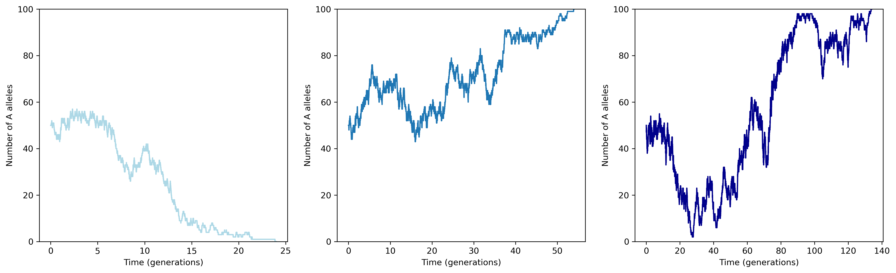

survival
========

*Difficulty*: ★★★★☆

.. figure:: ../../_static/boardroom_survival.png
    :align: center

    Survival of the fittest!

Welcome to the survival problem - where only the fittest survive!

Nah just kidding. In this problem you're going to simulate the spread of a mutation in a population of alleles and track genetic drift and natural selection. Not too tricky right?

Concepts
--------

For this problem, we're going to be implementing a Moran process. This is a simple model of genetic drift in a fixed-size population. In this population, individuals can have one of two alleles: :math:`A` or :math:`a`.

The population size is constant, and at each time step, one individual is chosen to reproduce and one individual is chosen to die. During reproduction, mutations can occur, changing an allele from :math:`A` to :math:`a` or vice versa. The rate of an :math:`A` allele mutating to :math:`a` is given by :math:`\mu`, and the rate of an :math:`a` allele mutating to :math:`A` is given by :math:`\nu`.

We can also model natural selection by assigning a relative fitness to the alleles. Let's say allele :math:`A` has a relative fitness of :math:`s` compared to allele :math:`a`, such that during each timestep, the probability of choosing an individual with allele :math:`A` to reproduce is proportional to :math:`1 + s`, while the probability of choosing an individual with allele :math:`a` is proportional to :math:`1`. Clearly, if :math:`s > 0`, allele :math:`A` is favored by selection and is likely to increase in frequency over time.

We **could** do some maths here to write out a diffusion equation for the allele frequency dynamics...

.. dropdown:: Warning: Maths is hidden here!

    If you really want to get into the nitty-gritty of the maths behind this process, the allele frequency dynamics can be described by the following diffusion equation which has terms for selection, mutation, and genetic drift:

    .. math::

        \begin{split}
            \bar{\omega} \cdot \frac{\partial P(x, \tau)}{\partial \tau} = &- \underbrace{s \frac{\partial}{\partial x}\bigg(P(x, \tau)\cdot x(1-x)\bigg)}_{\text{selection}} \\
            &+ \underbrace{ \mu \frac{\partial}{\partial x} \bigg( x \cdot P(x, \tau) \bigg) - \nu \frac{\partial}{\partial x} \bigg( (1 - x) \cdot P(x, \tau) \bigg)}_{\text{mutation}} \\ 
            &+ \underbrace{ \frac{1}{N} \frac{\partial^2}{\partial^2 x}\bigg(P(x, \tau)\cdot x(1-x)\bigg) }_{\text{drift}},
        \end{split}

    where :math:`\bar{\omega}` is the average fitness, which is given by

    .. math::

        \bar{\omega} =  \frac{1}{N} \bigg( n(1 + s) + (N - n) \bigg),

    :math:`P(x, \tau)` is the probability that the frequency of allele :math:`A` is :math:`x` at time :math:`\tau`, :math:`s` is the relative fitness of allele :math:`A`, :math:`\mu` is the mutation rate from :math:`A` to :math:`a`, :math:`\nu` is the mutation rate from :math:`a` to :math:`A`, :math:`N` is the population size, and :math:`n` is the number of individuals with allele :math:`A`.

    For more details and an animation of this whole process, check out `this link <https://www.tomwagg.com/html/moran_circles.html>`_.
                                                
...or we can just simulate it!

Self-assessment
---------------

This problem doesn't come with its own tests, but throughout the problem I've included some example plots of what you might expect the evolution of the system to look like. If your plots look similar to these, then you're probably on the right track!

This is of course a stochastic simulation, so your plots won't look exactly the same as mine, but they should have similar trends.

.. admonition:: My motivation

    Note that this isn't just me being lazy and not writing tests! One of the things you need to learn as a programmer is how to validate your code when there aren't any tests provided. This is a really important skill to have, especially in scientific programming where you might be implementing new algorithms that don't have any existing tests.

    So in this problem, I'm encouraging you to think critically about your implementation and how to validate it against expected behaviour and your intuition for how the evolutionary process *should* behave.

Your Task
---------

In this problem, you're going to implement a **class** called ``MoranModel`` in the ``problems/survival.py`` file. We're going to put what you've learned about classes, visualisation, and class inheritance to test. Excited? Me too!

Part 1 - Basic Evolution with Drift
-----------------------------------

1a - The Setup
^^^^^^^^^^^^^^

First up, implement the basic Moran process with genetic drift only. This means no selection (:math:`s = 0`) and no mutations (:math:`\mu = \nu = 0`), meaning it's fine for your class to ignore these parameters for now.

You'll need to implement the methods that are already outlined in the ``MoranModel`` class in ``problems/survival.py``.

**Initialisation**: First, consider how to initialise your class (this is done in the ``__init__`` method). You'll need to store the parameters as class attributes certainly, but also consider how you could store the counts of the A alleles over time, that'll be useful for you to track how things have evolved!

**The core logic**: Next, implement the core logic of the Moran process in the ``next_timestep`` method. This is where you'll randomly select one individual to reproduce and one individual to die, and update the counts of each allele accordingly. Since we're only considering genetic drift for now, the selection of individuals to reproduce and die should be completely random and based only on their current counts (e.g. if there are 7 A alleles and 3 a alleles, the probability of selecting an A allele to reproduce should be 0.7). This method will of course update the number of A/a alleles in the population, but you might also want to consider how to store the counts over time for later analysis.

**Advancing generations**: After that, implement the ``next_generation`` method, which should call ``next_timestep`` a number of times equal to the population size to simulate a full generation. This gives each individual a chance to reproduce and die and is a more logical unit of time to track.

**Running the simulation**: Finally, implement the ``run_for_generations`` method, which should run the simulation for a specified number of generations. This method should call ``next_generation`` in a loop.

.. admonition:: Testing time

    Now before you go any further, consider how you can test you implementation so far. If you started with a reasonably small population size (e.g. 100 individuals), what would you expect the allele counts to look like over time? What would you expect to happen after a long period of time? (I'll give away the answer to this below...)

1b - Plotting your results
^^^^^^^^^^^^^^^^^^^^^^^^^^

Now that you've implemented the basic Moran process with genetic drift, it's time to visualise your results! Implement the ``plot`` method in your ``MoranModel`` class. This method should create a plot showing the counts of allele A as a function of time. I recommend recording the counts at every timestep, but making your x-axis in units of generations for clarity.

You'll want to use ``matplotlib`` for this, and specifically the ``plt.plot()`` function to create the line plot. I recommend using ``plt.xlim()`` or ``ax.set_ylim()`` to set your y-limits to always show the full range (0, to the size of the population). And don't forget to label your axes!!

Here are three examples of what your plots might look like. Remember, this is a stochastic simulation, so I've made these plots with the exact same initial parameters (:math:`N = 100`, :math:`n_A = 50`, :math:`s = 0`, :math:`\mu = \nu = 0`), but the plots are still different, and yours may look different compared to these too.

.. figure:: ../../_static/moran_drift.png
    :align: center

    What do you notice happening in some of these plots? We'll talk about it more in the next section!

1c - Running until fixation
^^^^^^^^^^^^^^^^^^^^^^^^^^^

You may have noticed that in some of your plots, the allele counts eventually reach either 0 or the full population size. This is called fixation, and it's a natural outcome of genetic drift in a finite population. Since there's no mutation, once one allele reaches fixation, the other allele is lost from the population forever (sad).

Instead of running for a fixed number of generations, implement a new method called ``run_until_fixation`` that runs the simulation until one allele reaches fixation. This method should keep calling ``next_generation`` until the count of allele A is either 0 or equal to the population size.

Try making a plot of the allele counts over time when you run until fixation. How long does it take for fixation to occur? Does it vary between runs?

    Notice the different x-axis scales here - and you never know which allele will win!

.. dropdown:: Bonus: Distribution of fixation times

    If you're feeling adventurous, you could run a large number of simulations (say 10,000) of the Moran process with the same initial parameters and record the time it takes for fixation to occur in each run. You could then plot a histogram of these fixation times to see the distribution. This can give you insight into how genetic drift operates in finite populations.

    You could even try changing the initial frequency of allele A and see how that affects the distribution of fixation times - plots galore!

    .. figure:: ../../_static/moran_fixation_time_histogram.png
        :align: center

        A histogram of fixation times over 10,000 simulations with N=100 and initial n_A=50.

- Account for mutations
- Account for fitness
- Track counts over time
- Plot counts over time
- Inherit class and overwrite ``s`` with a dynamic function

